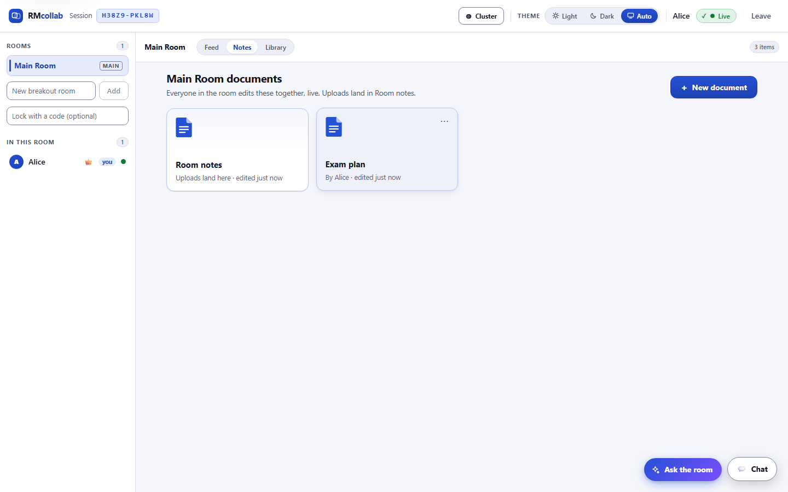
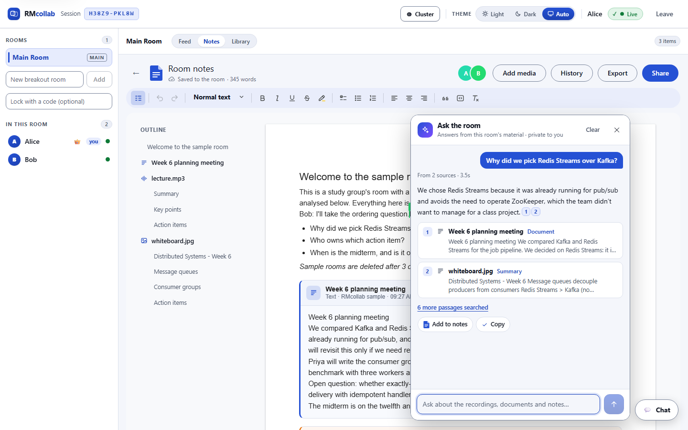
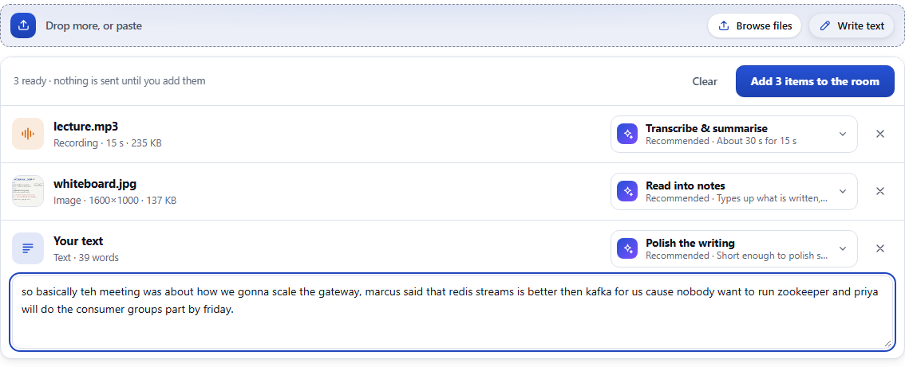

# RMcollab

Collaborative rooms for study groups and seminar teams. Each room has **shared notes that everyone
edits live**, and whatever the group drops in writes itself into them: a lecture recording becomes a
timestamped transcript and a summary, a whiteboard photo becomes typed notes, and action items
arrive as checklists - produced by GPU worker pools and streamed to everyone in the room in real
time.

Rooms are shared workspaces rather than calls: live notes, chat, presence, and a searchable library
the group can return to. Media also runs through swappable enhancement pipelines (GAN upscaling,
learned speech denoising) as standalone tools.

## A quick tour

**The room's notes.** A shared document laid out like a word processor. Each upload gets its own
section - here a meeting note, a lecture recording and a whiteboard photo, from the sample room -
filled in by the workers as the analysis finishes. Bob's cursor is live; the outline on the left
follows the headings and uploads.


**Several documents a room.** Notes opens on the room's documents, like a folder. Room notes -
where uploads land - is always there; anyone can start another (an exam plan, a report draft), and
it appears for everyone at once. Each has its own history and export.



**Ask the room.** A question answered from the room's own material, with every claim cited; a
citation opens its source - the recording at that second, the document, or the notes section.
Answers are private until someone adds one to the notes.



**Drop anything; it says what it will do.** Each file is recognised and measured, and given the
action that suits it - a recording is transcribed and summarised, a whiteboard read into notes, a
short scrawl polished. Nothing runs until the click.



**A whiteboard, read into notes** - seen by a second person, in dark mode. The vision model
transcribes what is written, describes the diagram, keeps exact details (`XAUTOCLAIM`, `91.7`), and
turns the written TODOs into a checklist the room can tick off.


**Transcripts tied to the recording.** Every line is timestamped; clicking a stamp plays the
recording from there, and the line being spoken is highlighted. Summary and transcript sit in tabs,
with copy and download.


**Edits you can see.** A rewrite marks what it changed - removals struck through, additions
highlighted - with a count of edits, so even a light touch-up is visible.


**A library that searches everything the room produced** - summaries, rewrites, image notes and
transcripts. A transcript hit says when in the recording the word is spoken, and opening it jumps
to that line.


**No accounts.** Start a session (or try the sample room), share its ten-character code, and split
into breakout rooms - lockable with a room code.


<sub>Screenshots come from a live stack and are regenerated with `npm run screenshots`, from the sample
room - so no image is sent to the vision model again, and a busy free tier cannot fail the run.</sub>

---

## Why this project exists

It's a rebuild of a Master's project, redesigned around the parts that are actually interesting
to engineer:

- **Distributed systems** - a stateless, horizontally-scaled gateway behind a load balancer;
  Postgres as shared source of truth; Redis pub/sub for cross-replica WebSocket fan-out;
  per-media-type task queues that scale independently.
- **Concurrency** - bounded worker pools sized per workload (many cheap text workers, one or
  two GPU-bound video workers), late acknowledgement so a killed worker's job is redelivered
  rather than lost, throttled progress streams.
- **Real-time** - WebSocket rooms with presence, typing indicators, live job progress, and
  reconnect/resync from a server-side snapshot.
- **Webhooks** - job lifecycle events delivered as HMAC-signed HTTP callbacks with exponential
  backoff, a delivery log, and manual replay.
- **Applied AI** - speech-to-text and LLM summarisation behind a provider-agnostic interface, plus
  interchangeable enhancement strategies selectable per upload and comparable side by side.

## Architecture

```
                   +-------+     +-------------+
  browsers <--WS-->| nginx |---->|  gateway    |--enqueue-->  Redis  -->  Celery worker pools
                   |  LB   |     |  (Node/TS)  | (Celery v2         |-- enhance.text   xN
                   | :4000 |     |  stateless, |  protocol)         |-- enhance.image  xN
                   +-------+     |  N replicas)|                    |-- enhance.audio  xN
                                 +------+------+                    +-- enhance.video  x1-2 (GPU)
                                        |                                     |
                                 Postgres (state)                        job events
                                        ^                              (Redis Stream)
                                        |                                     |
                                        +----------- gateway consumer <-------+
                                                            |
                                                   webhook dispatcher
```

**Why a hand-rolled Celery producer?** The gateway is Node and the workers are Python. There is
no maintained Node Celery client (`celery-node` was last published in 2022), so
[`gateway/src/queue/celery.ts`](gateway/src/queue/celery.ts) implements the Celery v2 wire
protocol directly over Redis - verified against the Kombu Redis transport, which LPUSHes a
JSON envelope onto a list keyed by queue name and drains it with BRPOP.

**Why every media type goes through the same queue abstraction** (even text, which is just an
API call): one job model, one retry policy, one progress mechanism. Worker pools then scale
independently per queue based on what the work actually costs.

## From enhancement to comprehension

Enhancement makes media prettier; comprehension makes it useful to a group, which is what a
shared room is actually for. So a job produces **named artifacts** rather than one result: an
enhancing strategy writes a single `enhanced` artifact, `transcribe` writes a `transcript`, and
`summarise` writes a `summary`. Artifacts persist against the room, so they are still there when
the group rejoins.

Measured on the target GPU (RTX 3050, 4GB), Whisper `small` at int8:

|                       |                                                 |
| --------------------- | ----------------------------------------------- |
| Transcription speed   | RTF 0.10-0.12 warm (~10x faster than real time) |
| First job in a worker | RTF ~2.9 - dominated by model load              |
| 30 minute lecture     | ~3 minutes                                      |

The gap between those first two rows is why the model is cached for the life of the worker
process: Celery workers are long-lived, so the load cost is paid once rather than per job. The
cost is a few hundred MB of the shared card held by the audio pool - the same trade the video
pool makes for Real-ESRGAN.

**Denoising before transcription was measured, and it hurts.** The original plan had
enhancement feed comprehension - denoise first so the transcript is cleaner. Scored by word error
rate across noise levels, spectral gating made transcripts slightly worse and DeepFilterNet much
worse (21% -> 67% WER in the noisiest case), despite DeepFilterNet being the better denoiser by
SI-SNR. A recogniser and a listener want different things. So denoising is off by default and
stays an opt-in; the full table is in [`workers/README.md`](workers/README.md).

Segment timings are written inline in the transcript file rather than into artifact `meta`,
because `meta` rides along on every WebSocket job event and room snapshot, and a long recording
has hundreds of segments.

**Any language model, chosen by config.** Strategies call
[`workers/common/llm.py`](workers/common/llm.py) and never import a vendor SDK, so Anthropic and
any OpenAI-compatible gateway (OpenRouter, Together, a local vLLM) are interchangeable through
environment variables. With nothing configured the LLM strategies advertise as unavailable and
text falls back to the offline `rulebased` cleanup, so the product still works with no key at
all. Long transcripts are summarised in parts and merged, so a full lecture does not need to fit
in one request.

**Documents, not before/after.** A comprehension job has nothing to compare against, so its card
shows the original recording above a tabbed Summary / Transcript view. Transcript timestamps
seek the recording and the line being spoken is highlighted as it plays; search narrows the
transcript to matching lines. The summary is model output and therefore untrusted, so it is
parsed into a small Markdown tree that React renders as elements - there is no route from summary
text to HTML, which the tests check with a `<script>` payload rather than trusting a sanitiser.

**Images become notes.** A photo of a whiteboard, slide or page goes to a vision model and
comes back as Markdown - headings, points, diagrams described in a sentence, and an "Action items"
list only if to-dos are actually written. It lands as a `summary` artifact, so the room's notes,
the library and search take it without a new kind. On a generated whiteboard (headings, a diagram,
two red TODOs, a figure) Gemini transcribed every line, kept `XAUTOCLAIM` and `91.7` exactly,
described the diagram as data flowing from gateway to Redis to workers, and turned the TODOs into
action items. Three decisions:

- **A separate `vision` task profile.** The text model is often not a vision model (Groq's gpt-oss
  is not), so images go wherever `LLM_VISION_*` points while text stays where it is. Vision counts
  as available only with a vision model named explicitly, or a Claude key: sending an image to a
  text model fails the job instead of degrading.
- **Downscaled before sending.** Vision models read at around 1,600 px; a 12-megapixel phone photo
  sent whole costs upload time and tokens for detail the model throws away.
- **The default, with a declared fallback.** Reading into notes is the image default, and the
  registry gained `@register(fallback=True)`: without a vision model the GAN upscaler runs, rather
  than whichever module happened to import first.

On a free tier the vision provider may keep what it is sent, which the strategy's description says
and the example `.env` repeats: this is for study material, not photos of people.

**Long recordings get chapters.** Past eight minutes, the summary opens with a table of contents -
`[HH:MM:SS] Topic`, from the transcript's own timestamps. The model finds chapters within each part
of a long transcript; code assembles them. Left to the model, the merge put 10 of 12 chapters in
the first 5 minutes of a 54-minute session (it kept the earliest when trimming) and moved them
below the summary. Code now sorts them, folds repeated neighbours, spreads the twelve across the
whole recording and puts them first - and every timestamp is checked to exist in the source.

**Edits you can see.** A careful rewrite of already-clean prose looks unchanged side by side, so a
text result marks its edits inline - removals struck through, additions highlighted, with a count
of edits and words changed. Paragraphs are aligned first and only changed stretches are diffed word
by word, so a long document stays fast; a size cap swaps an oversized stretch for a whole
replacement rather than freezing the tab. Look-alike characters are treated as equal: a model was
caught swapping ordinary hyphens for non-breaking ones, which a naive diff reports as edits no one
can see.

**A room is worth coming back to.** The Library view lists every document a room has produced
and searches them with Postgres full-text search - a generated, weighted `tsvector` over each
artifact's text with a GIN index, so "pelican" finds "pelicans" and `"fan out" -redis` works as
typed. No search service: at this size the database already does it. Details:

- **Text is copied in once, when a job lands.** The gateway reads each text artifact from shared
  storage as it records the job, so a document is searchable the moment it exists; older rows
  are backfilled at boot. The file stays the source of truth for serving.
- **The text never leaves the database by accident.** Job events and room snapshots select
  artifact columns explicitly, so a three-hour transcript does not ride along on every WebSocket
  frame. An end-to-end test asserts it.
- **Highlights are not HTML.** `ts_headline` marks matches with two control characters that are
  stripped from the text on the way in, so the client renders highlights without ever parsing
  markup from the server.
- **A transcript hit knows when it was said.** The first transcript line matching the query gives
  a timestamp; opening the hit switches to the feed and brings that line into view, without
  starting playback.
- **Private rooms stay private.** The library is guarded like uploading: session membership is
  not enough to read a locked room's documents.

## Swappable strategies

Adding a new approach is **one file and one decorator**, with no changes anywhere else:

```python
@register
class MyEnhancer(BaseEnhancer):
    media_type = "image"
    name = "my-approach"
    label = "My Approach"

    def enhance(self, input_path, output_path, params, progress):
        ...
```

It then appears automatically under "More options" when adding media. See
[`workers/README.md`](workers/README.md).

**People are not shown the strategy list first.** Adding media is a drop zone that takes several
files (or pasted text) at once. The client identifies each item and measures it - word count,
image size, recording length - then proposes the action that suits it in plain language, with the
reason: a long text gets "Summarise", a short one "Polish the writing", a small image "Sharpen &
upscale", a 42-minute recording "Transcribe & summarise - about 5 min". Nothing is sent until the
person clicks; every other strategy stays one click away. The recommendation follows the live
adverts below, so without a vision model an image falls back to upscaling rather than proposing
something that cannot run (`client/src/lib/detect.ts`, `client/src/lib/recommend.ts`).

The browser's guess is a convenience, not a trust boundary. The gateway reads each upload's magic
bytes (`gateway/src/http/sniff.ts`): content it does not recognise is refused with 415, and a file
whose bytes disagree with its declared type - an `.mp4` that is really audio - is routed by what it
actually is.

Strategies declare whether they can actually run (`available()` - an API key, model weights, a
GPU). Workers advertise their live registry into Redis under a TTL heartbeat and the gateway
mirrors it, so what is offered reflects the pools that are genuinely online rather than a list baked
into the code. An unavailable strategy stays visible but greyed out, never wins default
resolution, and if you request one anyway the job reports which strategy ran instead and why.

**Jobs are routed by capability, not by media type.** Each advert carries the queue that reaches
the pool able to run it, and the gateway sends a job there. That is what lets a lecture _video_ be
transcribed by the _audio_ pool: comprehending a video is audio work, and the audio pool is where
Whisper is already loaded. The class lives in the audio package with `media_type = "video"`, so
the audio pool registers and advertises it and the video pool never loads it. The alternative -
transcribing in the video pool - would put a second Whisper on the same 4GB card and queue every
lecture behind upscales in a pool that runs one job at a time.

Three rules keep that honest, each added because something broke without it:

- **A pool advertises only what its own packages define.** Video upscaling imports the image
  Real-ESRGAN module, which registers the image strategies in the video pool as a side effect.
  Advertised, they overwrote the image pool's adverts - last writer wins - and image jobs could be
  routed to the video queue. Ownership is by defining package, not by what happens to be loaded.
- **A pool imports only the packages it serves.** Resolving a video job in the audio pool would
  otherwise import the whole video package, torch and all, into it.
- **One default per media type, merged at the gateway: declared beats fallen-back.** Each pool
  knows only its own registry, so the video pool alone reports `classical` as its default while
  the audio pool declares `comprehend`. The gateway prefers declared-and-available, then
  available, so if the audio pool is down, video degrades to upscaling rather than failing.

The advert shape is checked across both languages by `npm run check:contracts`, like the job
payload and job events: routing now depends on it.

| Media | Strategies                                                                                                                                                                                                    |
| ----- | ------------------------------------------------------------------------------------------------------------------------------------------------------------------------------------------------------------- |
| text  | `rulebased` (deterministic offline cleanup - no key, no network) / `rewrite`, `summarise` (any configured language model)                                                                                     |
| image | **`notes`** (whiteboard, slide or page read into notes by a vision model) / `realesrgan` (GAN 4x super-resolution; the fallback when no vision model is configured) / `classical` (gamma + CLAHE, sub-second) |
| audio | **`comprehend`** (transcript + summary) / `transcribe` (Whisper speech-to-text) / `spectral` (noise gating) / `deepfilternet` (learned speech enhancement)                                                    |
| video | **`comprehend`** (transcript + summary from the soundtrack; runs in the audio pool) / `classical` (per-frame, ~6ms/frame) / `realesrgan` (per-frame GAN, opt-in and frame-budgeted)                           |

Measured on the same card: Real-ESRGAN upscales 1280x720 to 5120x2880 in 58s at 756MB peak
VRAM - it runs **tiled**, because a naive full-frame pass OOMs a 4GB card. Audio denoising
measures +9.6 dB (spectral) and +16.7 dB (DeepFilterNet) SI-SNR improvement on a noisy 12s clip,
at well under real time.

Model weights download on first use into a named volume and are verified by size and SHA-256,
so a truncated download fails loudly instead of producing garbage.

## Room notes: one shared document, edited live

Each room has a notes page that everyone in it edits at once, laid out like a word processor -
a page on a canvas, a formatting toolbar, a document outline - with each person's cursor and name
visible. It is where the room's understanding accumulates: **every upload writes into it.** A file
gets its own section the moment it is accepted, and the section fills with the analysis when the
job finishes - a summary's headings and points, its action items as a real checklist, a
transcript's opening lines, a rewrite's text - live, for everyone in the room.

**Concurrent editing is a CRDT, not last-write-wins.** Two people typing into the same sentence
at the same moment must both keep their words; saving whole-document snapshots would drop one.
The document is a [Yjs](https://github.com/yjs/yjs) CRDT with a TipTap editor bound to it, so
concurrent edits merge deterministically on every client without a central lock.

How it runs across a horizontally scaled gateway:

- **One transport.** Sync and presence travel as y-protocols messages (the y-websocket wire
  format) inside the existing JSON socket, so the room access check that guards chat and uploads
  guards the document too - a locked room's notes are exactly as private as the room.
- **Every replica holds a copy while it has editors, and Redis carries the edits.** A replica
  applies a local edit, publishes it, and - following the same publish-then-deliver rule as the
  rest of the room - every replica applies what arrives and forwards it to its own editors, minus
  the author. No ordering or de-duplication is needed: CRDT merges are commutative and idempotent.
- **A replica's copy lives exactly as long as its Redis subscription.** Kept any longer, it would
  miss edits made elsewhere and hand the next joiner a stale document. When a replica loads a
  room it also re-reads storage once after a batch window, catching an edit another replica had
  published but not yet saved.
- **Keystrokes are batched.** Updates merge into one row per 400 ms per room instead of one per
  key: a whole cross-replica editing session measured at two rows. The window cannot lose work:
  every editor holds the full document, and the sync handshake on reconnect sends the server
  exactly what it is missing - an edit survives even a replica dying before it saved. That
  depends on the editor's copy outliving the connection, which it once did not: a dropped socket
  took the whole room view down until the snapshot returned, unmounting the editor and destroying
  its document with whatever it had not yet sent. The view now stays up through a reconnect
  (`loadedRoomId`), and a test types while the socket is cut and reads the words back from the
  server after a reload.
- **Compaction happens in the database.** Batches fold into a snapshot under a transaction-scoped
  advisory lock, from what is stored rather than any replica's memory. It deletes exactly the rows
  it merged, never "everything up to seq N": a sequence number is taken at insert but visible only
  at commit, so another replica's batch can hold a lower number and still be unmerged.
- **Presence is ephemeral, and answered.** Cursors are never stored. When a newcomer appears,
  existing editors re-announce immediately rather than on the 15 s renewal, so someone joining
  through another replica sees everyone at once. Colours from other browsers are untrusted and
  only a plain `#rrggbb` is ever put in a style.
- **Undo is yours alone.** History is the CRDT's per-user undo manager: undo takes back your own
  typing, never a collaborator's.

**The AI is a collaborator that only adds.** The gateway writes into the same CRDT the editors
do, as one more peer. Rules it keeps:

- **A placeholder is saved before the job is queued.** A job's completion can be handled by a
  different replica, which - if nobody in the room is connected to it - loads the notes from
  storage. Had the placeholder still been in a save batch, that replica would not find it and the
  upload would get two sections. So this one write is saved synchronously; everything else batches.
- **An untouched placeholder is replaced; anything a person typed stays,** with the results added
  after it. **A section a person deleted stays deleted:** the writer records which uploads it has
  placed a section for, in the same document, so "missing" can be told apart - never written,
  versus removed on purpose.
- **Filled exactly once, cluster-wide.** Completion is driven by the job-event consumer group, and
  only the event that moves a job to done or failed gets past the idempotent update - a redelivery
  finds the job already terminal.
- **Progress is not written into the document.** It ticks several times a second; each tick would
  be a CRDT update and a stored row. The section reads live progress from room state instead,
  which every client already has.
- **The document schema is a contract.** The editor's collaboration binding does not show an
  element its schema rejects - it deletes it. So the section builder lives in `shared`, used by the
  gateway, and a client test loads everything it can produce into the real editor schema and fails
  if anything would be dropped.

**Several documents, one machinery.** A room's main document keeps the room id as its key, so
notes from before there were several load unchanged; any other document is keyed `<roomId>:<docId>`.
The hub, storage, history and compaction all work per key, and only the storage layer and the
socket protocol split one; a doc frame names its document, and a socket is checked into a document
of its room once before its edits are applied, so a made-up id cannot become a document. Ask the
room searches every document in the room, and a citation carries which document it came from.

**Version history.** Anyone in a room can edit its notes, so anyone can erase them. Restore points
are taken hourly while a room is edited and, crucially, *before a large deletion*: the hub keeps a
copy of the document at most 30 seconds old and, once per saved batch (not per keystroke), checks
whether the notes shrank by 40% and 400 characters; if so, that copy is saved. A "Version
history" panel lists the points with a preview; restoring replaces the notes for everyone, as a
live edit, after first saving what was there - so a restore can itself be undone. A room keeps its
latest 50.

The editor is split out of the main bundle and loaded on first use (66 KB vs 168 KB gzipped).
`npm run check:notes-replicas` runs two editors against two gateway replicas directly, bypassing
the load balancer so they are guaranteed to be on different replicas.

**Export.** The notes download as Markdown - serialised from the editor's own document with
`prosemirror-markdown`, so checklists, highlights and each upload's section (with who added it and
when) survive - optionally with the full transcripts appended. PDF is the browser's print dialog
over a dedicated print layout: a clean copy of the document is rendered outside the app, whose
fixed-height scrolling panels would otherwise clip a printed page to one screenful.

## Ask the room: answers from the room's own material

Ask lives in a dock beside the chat - a pill in the corner of every view, or Ctrl/⌘+K - so a
question is never more than a keystroke away, and the answer stays on screen beside whatever source
it opens. A question like _"what did we decide about Kafka?"_ is answered from what the room holds -
transcripts, summaries, uploaded documents and the shared notes - with every claim cited. A
citation opens its source: a recording at the moment the passage is spoken, a document in the
feed, a notes section scrolled into view. Answers are private to whoever asked, until they choose
**Add to notes**, which appends the question, the answer and its sources to the shared notes as
their own (undoable) edit.

```
  question ──ws──▶ gateway ──ask queue──▶ ask worker: embed the question + the notes' sections
                     │  ◀──── vectors, on a per-request pub/sub channel ─────┘
                     │  rank the room's passages + notes (pgvector + full text, fused)
                     ├──ws──▶ asker: the numbered sources
                     └──ask queue──▶ ask worker: write the answer from those passages
            asker ◀──ws── gateway ◀──── answer, streamed in pieces ─────┘
```

**Why it is split this way.** The embedding model is Python; the database belongs to the
gateway. Workers stay stateless compute - they never read the database - so a question makes two
trips: the worker embeds, the gateway retrieves, the worker writes. Replies travel on a pub/sub
channel only the asking socket's replica listens on, so it works across gateway replicas without
any stickiness. Questions have **their own queue and pool**, so an answer never waits behind a
20-minute lecture being summarised.

**Passages.** Each searchable document is split once, as its job finishes (older ones by a
backfill at boot): transcripts into runs of spoken lines about 700 characters long that overlap by
one line and keep the second they start at; documents by paragraph, each passage prefixed with its
section heading so "Priya drafts it" still reads as an action item. The worker embeds them in
batches and sends the vectors back on a Redis stream that one gateway consumes. The notes change as
people type, so they are cut into sections at question time; their vectors are cached by content,
and only edited sections are embedded again.

**The embedding model was chosen by measurement, not reputation.** `e2e/fixtures/ask-eval.json`
is a labelled set: one study group's material, with distractors, and 21 questions whose answer
sits in a known passage - many of them paraphrases sharing no words with it ("when is the exam?"
for "the midterm is on the twelfth"). `workers/tools/eval_embeddings.py` compares local models on
it:

| Model                              | Size   | Right passage first | In top 3 | per question |
| ---------------------------------- | ------ | ------------------- | -------- | ------------ |
| bge-small-en-v1.5 (the first plan) | 67 MB  | 0.89                | 0.94     | 14 ms        |
| bge-base-en-v1.5                   | 210 MB | 0.89                | 1.00     | 83 ms        |
| all-MiniLM-L6-v2                   | 90 MB  | 0.94                | 0.94     | 22 ms        |
| **snowflake-arctic-embed-m**       | 430 MB | **0.94**            | **1.00** | 40 ms        |

(The first 18 questions; the three identifier questions were added later.) It runs locally
(fastembed, ONNX on the CPU): a room's lectures stay on the machine, and there is no quota. The Ask
pool runs threads, not processes, so one copy of the model serves every job.

**Keywords barely count, and that was measured too.** The plan was the usual hybrid - meaning
and keywords ranked separately, then merged - on the theory that keywords catch the exact names
and codes embeddings blur. On the full set, including exact identifiers (`XAUTOCLAIM`,
`CS-451 HW3`, `allkeys-lru`):

| Keyword weight in the merge | Right passage first | In top 3 |
| --------------------------- | ------------------- | -------- |
| 0 (meaning only)            | 0.90                | 1.00     |
| 0.3                         | 0.81                | 0.90     |
| 0.5                         | 0.81                | 0.90     |

A common word ("under **load**") dragged in passages that merely shared it ("**load**
balancer"). So keywords are weighted at 0.01: less than one step of the meaning ranking, enough to
break near-ties and to keep a passage findable before its embedding lands. The e2e test re-runs
the whole set against the live stack and fails if the answer drops out of the top three for more
than one question.

**Follow-up questions.** Each question used to be answered on its own, so "and who owns that?"
found nothing. The browser now sends the asker's last three turns with a question (the gateway
keeps no conversation - a question is private), and the worker rewrites a follow-up into one that
stands alone before it is embedded: "when is that due?" after a question about Priya's section
becomes "when is the consumer groups section due?". That rewrite is what is searched and answered,
and the panel shows it ("Searched for: ..."), so a misreading is visible. Without a model, the
previous question is prepended, which carries the missing context into the search. The question
set has follow-ups too, each with the turn it follows, and the e2e test measures them.

**Grounding.** The model is told to answer only from the numbered passages, cite each claim, and
say "The room's material doesn't cover this" otherwise; passages are marked as material, never
instructions. The gateway keeps only citations that point at a passage it actually sent. With no
model configured, or its quota spent, the asker still gets the passages that matched. Six questions
a minute per person; a locked room's material is only askable by people let into it.

## Access and security

- **Private breakout rooms.** A session code gets you into a session; a room can additionally be
  locked with its own code when it is created. A locked room admits only participants who have
  presented its code, and remembers them so a reconnect does not ask again. The room's creator
  is marked as its owner and can reveal the code to share it. The code is never included in any
  room listing - rooms carry only an `isLocked` flag.
- **Presigned media URLs.** Uploaded and generated media are served to ``/`<video>` tags,
  which cannot send an auth header, so every file URL carries an HMAC signature and an expiry
  (the S3 approach). A bare or tampered path returns 403.
- **SSRF-safe webhooks.** Outbound webhook URLs are validated against private, loopback and
  link-local ranges by resolving the hostname rather than pattern-matching it.
- **Session codes that cannot be guessed.** Ten characters from an alphabet without look-alikes
  (no I, O, 0 or 1): about 50 bits, where the original six could be enumerated. Shown as
  `ABCDE-23456`, typed with or without the dash in any case; older six-character codes still work.
  Length alone is not relied on - an address that tries 20 codes that do not exist in ten minutes
  is refused for a while, over HTTP and over the socket alike. The address is the one the load
  balancer saw; a forwarded header from the client is not trusted.
- **Removing people.** A room's owner can remove someone. From a breakout room they are moved to
  the main room and barred from coming back into it, even with its code; from the main room -
  owned by the session's first participant, in practice whoever started it - they are removed from
  the session. Their connections are taken out on the server, not just told to leave, so a client
  that ignores the notice cannot stay.
- **Keeping them out.** With guest identity a removal bars a participant id, not a person, who
  could come back with the code under a new name. So removing someone from the session also
  **changes its code**: the owner is shown the new one to share, and the old one lets nobody new
  in. It is retired rather than forgotten, so everyone still in the session - a reload, a rejoin
  from Recent sessions - carries on without noticing. For a tighter room the owner can switch on a
  **waiting room**: someone new then sees only "Waiting to be let in" until the owner admits or
  turns them away, and their socket is told nothing of the session meanwhile - no rooms, no
  participants, no messages. Anyone already admitted comes straight back.
- **Members only, everywhere.** Every HTTP route authorises through one check, which also asks
  whether the participant is still in the session: someone removed (or still in the waiting room)
  keeps their participant id in their browser, and before that check it still read the notes,
  searched the library and uploaded. Making a room needs a current member too, not just the code.
- **Owners can hand over, and end.** The owner can make someone else the owner (they get the
  waiting room, removals and ending; the previous owner becomes a member), or **end the session**:
  everyone is told and sent back to the start, then every room, note, message and file is
  deleted at once rather than after three idle days. Anyone may delete their own chat messages;
  a room's owner and the session's owner may delete any.
- **Guest identity, and getting it back.** There are no accounts: a participant id is effectively
  a bearer token, and the owner-only endpoints are exactly as strong as that id - a deliberate
  scope choice for a classroom tool. What would be lost with it (a cleared browser takes the
  owner's controls with it) is covered by a **private link**: under the session code, *Copy my
  private link* gives `/join/CODE#as=<id>`, which continues as you on any device. The id sits
  after the `#`, which browsers never send to a server, so it stays out of logs and Referer
  headers; the page says plainly that whoever holds it is you. Ordinary **invite links**
  (`/join/CODE`) open the join screen with the code filled in.

**Cross-language contracts are enforced, not remembered.** Worker job events are produced in
Python and consumed in TypeScript. `npm run check:contracts` parses both definitions and fails
with a specific diff if they drift - including the deliberate camelCase/snake_case split between
the two payloads.

## Running in public: limits, budgets and expiry

Anyone with a session code can upload, and every upload is GPU or model work, so what things
cost is bounded before anything is stored (`gateway/src/limits.ts`, `workers/common/budget.py`):

| Limit                            | Default                           | Set with                                                  |
| -------------------------------- | --------------------------------- | --------------------------------------------------------- |
| Uploads per person               | 10 a minute, 60 an hour           | `LIMIT_UPLOADS_PER_MINUTE`, `LIMIT_UPLOADS_PER_HOUR`      |
| Uploads per session              | 200 an hour                       | `LIMIT_SESSION_UPLOADS_PER_HOUR`                          |
| Jobs queued or running, per session | 12                             | `LIMIT_ACTIVE_JOBS_PER_SESSION`                           |
| Storage                          | 500 MB a room, 2 GB a session     | `LIMIT_ROOM_STORAGE_MB`, `LIMIT_SESSION_STORAGE_MB`       |
| Sample rooms                     | 6 an hour per address             | `LIMIT_DEMOS_PER_HOUR`                                    |
| New sessions                     | 30 an hour per address            | `LIMIT_SESSIONS_PER_HOUR`                                 |
| Open connections                 | 100 per address                   | `LIMIT_CONNECTIONS_PER_ADDRESS`                           |
| Questions (Ask the room)         | 6 a minute per person             |                                                           |
| Chat, per connection             | 10 at once, then 1 a second       |                                                           |
| Notes traffic, per connection    | 3000 frames and 16 MB at once, then 300 and 2 MB a second |                   |
| Model calls                      | per task, per UTC day (below)     | `LLM_<TASK>_DAILY_BUDGET` (`0` = no limit)                |

Rate windows are counted in Redis, so every replica enforces the same numbers; a refusal says
which limit was hit and when it lifts, with a `Retry-After` that is right even for someone who
kept retrying (refused attempts count, so it is when a retry would fit, not when the oldest
attempt expires). Retries count as uploads - they spend the same GPU time.

**A refused upload is never stored.** The app names the uploader in the URL, so identity, room
access, the rate limits and the declared size are all checked before the file is read; a refused
file is read and thrown away rather than cut off, because a browser answered mid-upload reports a
network error instead of the reason. An accepted file streams to disk, never into memory. The
storage limit is then checked against the real size and the upload recorded *as one step* per
session, under a Postgres advisory lock: measured separately, ten 60 MB uploads racing into a
500 MB room all fitted; now eight go in and two are refused, as they should be.

**Cheap things are limited too.** Chat, typing and notes frames cost nothing to send, which is
what makes flooding a room with them easy, so each connection has token buckets for them
(`gateway/src/ws/rateLimit.ts`). Chat past its limit is refused with a reason; typing is dropped;
notes past theirs close the connection, because dropping a CRDT update would leave that editor
out of step, while a reconnect resyncs the whole document. Normal use never comes near them.

**Upload options are the operator's.** A strategy reads settings like which Whisper model to
load, the device, beam size and tile size; those decide what a job costs, and one makes the
worker download whatever model it is named. An upload may set only `denoise` and `language`;
everything else is dropped by the gateway (`safeParams` in `media.ts`).

**Sessions take turns for the workers.** The pools are shared, and on a CPU-only host a lecture
takes longer to transcribe than it lasts: in arrival order, one group dropping in twelve would
hold every other group up for a day. So jobs no longer go straight onto a pool's Redis queue -
a Celery queue is first in, first out. They wait in Postgres, and a dispatcher
(`gateway/src/queue/dispatcher.ts`, one replica at a time under an advisory lock) keeps each
pool's queue topped up to two, choosing fairly (`queue/fair.ts`): a session's next job ranks
behind what it already has in flight, so one with nothing running goes next whatever its arrival,
and ties go to the session served longest ago. That last rule came from the end-to-end test,
which failed half the time without it: on a fast pool a session's earlier jobs had finished
before the next choice, so it tied with a session never served and won on age.

**A waiting job shows its place in line.** Worker pools are shared by every session, so on a busy
or CPU-only host a job waits behind other people's. While something in a room is queued, the
feed reads where each job stands in its pool's queue (`/api/rooms/:roomId/queue`) and says "3
ahead in the queue" or "Next in line" instead of an unchanging "Waiting for a worker". It is
worked out with the dispatcher's own ordering, so the number is the order the work really
happens in.

**Model budgets pause a feature instead of failing jobs.** Free tiers cap requests per day -
Gemini's image model at 20 - so each task profile has its own daily allowance of calls (image
reading 18, summaries 300, rewrites 800, answers 800), counted cluster-wide. A provider's own
"daily quota exceeded" marks the budget spent too, so nothing keeps calling a model that will
refuse. A spent budget makes the strategies that need it report themselves unavailable, *with a
reason*, through the same adverts that route jobs: the Add media panel then shows "Image reading
is paused until tomorrow" and recommends what can run (sharpening, for an image), a recording is
still transcribed with a note that its summary is paused, and Ask returns the matching passages
without an answer.

**Nothing lives for ever.** A session nobody has touched for three days (`SESSION_TTL_DAYS`) is
deleted - rooms, uploads, notes, chat, files - or for thirty (`SESSION_KEEP_DAYS`) if its owner
switched on **Keep for 30 days**: a group that meets weekly would otherwise lose its room between
meetings. Everyone in the session sees which applies. Activity is recorded at most every few minutes per
session, so typing is not a write per keystroke. An hourly sweep, one replica at a time under a
Postgres advisory lock, deletes idle sessions and then any stored folder no row points at (a
worker that finished writing after its upload was deleted). The landing page says so, and says
that uploads go to third-party models.

**People can take things back.** Whoever added an upload - or the room's owner - can rename or
delete it; deleting removes its results, its searchable passages, its section in the notes and
its files, and the whole room hears. A room's owner can delete a breakout room, and anyone inside
moves to the main room. A failed upload has a Retry button (anyone in the room can use it), and
pasted text is titled by its first words instead of "Text from Alice".

**Getting back in.** The landing page lists the sessions this browser has joined, and rejoining
one comes back as the same participant - which is what keeps your right to rename or delete what
you added. There are still no accounts: the list is in the browser, and it is the whole of "my
rooms". **Try a sample room** opens a session already holding a lecture, a whiteboard photo and a
meeting note, with the results this app really produced for them (`gateway/demo/`). It is
assembled from those saved results, so opening one costs no GPU time or model quota.

## Webhooks

**Off in production unless `WEBHOOKS_ENABLED=true`, and the session owner's only.** An endpoint
receives every job event of its session, signed file links included - registering one is reading
everything - so each route below needs the owner's `participantId`. Before that they needed only
the session code, and deleting, listing deliveries and replaying needed nothing at all.

Job lifecycle events are delivered to registered endpoints as signed HTTP callbacks by a
dispatcher that runs as its own container - same image as the gateway, different entrypoint, so
it reuses the DB and shared code while scaling independently. It reads the job-event stream
under its own Redis consumer group, so gateway and dispatcher each see every event.

```
POST /api/sessions/:code/webhooks   { url }   -> returns the signing secret once
GET  /api/webhooks/:id/deliveries             -> every attempt: status, latency, error
POST /api/webhooks/deliveries/:id/replay      -> re-queue a failed delivery
```

Signature: `X-RMcollab-Signature: t=<unix_seconds>,v1=<hex HMAC-SHA256>` over `"<t>.<body>"`.
The timestamp is inside the signed string so a receiver can reject a replayed-but-valid body by
age - signing the body alone would leave captured requests valid forever.

Retries use exponential backoff with jitter, bounded at 5 attempts, and are scheduled in a Redis
sorted set rather than an in-process timer - so pending retries survive a dispatcher restart
instead of being silently dropped. 5xx/429/network errors retry; other 4xx are terminal, because
a receiver returning 400 will return 400 again.

## Stack

| Layer         | Choice                                                                                               |
| ------------- | ---------------------------------------------------------------------------------------------------- |
| Client        | React 18, TypeScript, Vite                                                                           |
| Edge          | nginx - load balancing across gateway replicas, WebSocket upgrade                                    |
| Gateway       | Node 20, Express, `ws`, ioredis, `pg`                                                                |
| Workers       | Python 3.11, Celery, Redis broker                                                                    |
| Models        | faster-whisper, Real-ESRGAN (RRDBNet), DeepFilterNet; LLM via Anthropic or any OpenAI-compatible API |
| State         | Postgres 16 with pgvector (built on the same Alpine base; see infra/postgres/Dockerfile)              |
| Bus           | Redis - pub/sub (fan-out), Streams (job events), lists (task queues)                                 |
| Orchestration | Docker Compose, NVIDIA GPU passthrough                                                               |

## Running it

```bash
docker compose -f infra/docker-compose.yml up --build
```

The stack runs with no keys at all. Settings and keys go in a `.env` at the repo root, which is
gitignored and reaches the containers through compose's `env_file`, never an image. To enable the
LLM strategies (`rewrite`, `summarise`), set **either** `ANTHROPIC_API_KEY`, **or**
`LLM_BASE_URL` + `LLM_API_KEY` + `LLM_MODEL` for any OpenAI-compatible gateway.

Error tracking is off until you give it somewhere to send: set `SENTRY_DSN` (gateway and workers)
and `VITE_SENTRY_DSN` (the browser) in `.env`, from a Sentry project's Client Keys. It reports
errors only, and never content: request bodies, headers, query strings, task arguments, local
variables and log breadcrumbs are all stripped before sending, and session codes are blanked
wherever they appear (`shared/src/scrub.ts`, `workers/common/errors.py`, both tested).

- App: http://localhost:5173
- API (via the load balancer): http://localhost:4000 (`/health`, `/api/strategies`, `/api/metrics`)

The image, audio and video pools reserve an NVIDIA GPU. On a machine without one, remove the
`deploy.resources` block from `x-ml-worker` in `infra/docker-compose.yml` - the reservation is a
hard requirement for the container to start, though every strategy itself falls back to CPU.

## Deploying

A production stack is the development one with an override on top, for any host that runs
Docker - a single VPS is enough:

```bash
# in .env, next to the model keys:
#   DOMAIN=rmcollab.example            the public host name, pointed at this machine
#   FILE_SIGNING_SECRET=...            openssl rand -hex 32
#   POSTGRES_PASSWORD=...              openssl rand -hex 32
#   REDIS_PASSWORD=...                 openssl rand -hex 32
#   SENTRY_DSN=... VITE_SENTRY_DSN=... optional
docker compose --env-file .env -f infra/docker-compose.yml -f infra/docker-compose.prod.yml up -d --build
# on a host with an NVIDIA GPU, add:  -f infra/docker-compose.gpu.yml
```

What the override changes (`infra/docker-compose.prod.yml`):

- **One public entrance.** `web` is Caddy (`infra/web`): it gets and renews the HTTPS certificate
  by itself, serves the client as a static build, and proxies `/api`, `/ws` and `/files` to the
  gateway replicas, which it finds by name - `--scale gateway=N` needs no config change. Ports 80
  and 443 are the only ones published; the Vite dev server and the dev load balancer are not run.
  It sets HSTS, `nosniff`, `X-Frame-Options` and caches hashed assets for good.
- **Secrets are required, twice over.** Compose refuses to start without them, and the gateway
  refuses to start in production with a development default: a short or default
  `FILE_SIGNING_SECRET` (anyone could sign a link to any file), `ALLOWED_ORIGINS=*`, private
  webhook targets allowed, or a non-https `PUBLIC_BASE_URL` (`productionProblems` in `config.ts`).
  Postgres and Redis get passwords and no host ports.
- **No GPU assumed, and measured without one.** `workers/tools/cpu_bench.py`, on 4 CPU cores
  with the GPU hidden (an x86 desktop - a guide to a 4-core ARM VM, not a substitute):

  | Work                             | Without a GPU                                   | So on a CPU-only host                       |
  | -------------------------------- | ----------------------------------------------- | ------------------------------------------- |
  | Whisper `small` transcription    | 2.66x real time (a 1-hour lecture: ~2.7 hours)   | not the default                             |
  | Whisper `base` transcription     | 1.40x real time, same words to within one        | the default (`small` stays the GPU default) |
  | Real-ESRGAN, one 1.6 MP photo    | unfinished after 28 minutes (>17 min per MP)     | offered as unavailable, with the reason     |

  So without a GPU, image and video upscaling say "Upscaling needs a GPU, and this server has
  none" and the pools fall back to sharpening, rather than taking jobs that would run for an hour
  (`ALLOW_CPU_UPSCALE=true` offers them anyway). The GPU override gives the media pools the card
  back, with both. The queue position in each card is what keeps a long transcription from
  looking like a hang.

- **Nightly backups.** The `backup` service dumps the database at 03:00 UTC (`BACKUP_HOUR_UTC`)
  into `./backups`, keeping the newest 14 (`BACKUP_KEEP`). Each dump is written under a temporary
  name and renamed only when complete, so one cut off half way never sits among the good ones.
  Verified by restoring a dump into a scratch database: every row count matched, embeddings
  included. Copy them off the machine too - a backup on the disk it protects survives a bad
  deploy, not a lost disk. To restore one:

  ```bash
  docker compose ... exec -T postgres pg_restore --clean --if-exists --no-owner \
    -U rmcollab -d rmcollab < backups/rmcollab-YYYYMMDD-HHMMSS.dump
  ```

- **Nothing operational is public.** `/api/metrics` answers only `Authorization: Bearer
  $METRICS_TOKEN` in production (not at all without one), and the header's cluster panel is
  left out of production builds. New sessions are limited to 30 an hour and open connections to
  100 per address - generous, because a class on school wifi is one address.
- **Runs on ARM.** Oracle's free Ampere machines are ARM: the GPU image installs PyTorch's CPU
  build there, and every Python dependency ships ARM wheels (checked down to DeepFilterNet's Rust
  core, CTranslate2 and ONNX Runtime), so nothing compiles on the server. CI builds every image
  on a native ARM runner.

**After a deploy**, `npm run smoke -- https://your-domain` checks the live site end to end and
cleans up after itself: health, the app's security headers, http to https, a session joined over
the socket, an upload processed by a worker, its signed link (and the same path unsigned
refused), CORS refusing another site, metrics and webhooks closed, and the session ended. It
exits non-zero on any failure, naming it, so it can gate a deploy script.

Checked on this machine with `DOMAIN=localhost` (Caddy's locally trusted certificate): the app
over https with HTTP redirected, a session joined over `wss://`, an upload processed by a worker,
its signed link served over https, CORS granted to the app's own origin and to no other, and the
gateway refusing to boot with weak settings, listing each one.

## Choosing a model

Free models were compared on a 54-minute study-group transcript with twelve facts planted at the
start, middle and end - dates, a room, a grade weight, a measured figure, three action items with
owners, two open questions - plus two traps: an idea the group rejects and a number someone
retracts. Each summary was scored for facts kept, then read for anything stated wrongly.

| Model (free tier)        | Setup                         | Facts kept     | Errors found by reading                                                   | Time   |
| ------------------------ | ----------------------------- | -------------- | ------------------------------------------------------------------------- | ------ |
| **Gemini 3.5 Flash**     | whole transcript, one request | **12, 12, 12** | none                                                                      | 19-30s |
| Gemini 3 Flash (preview) | whole transcript, one request | 11, 11, 11     | inverted a fact once (said the system _uses_ the outbox pattern it lacks) | 8-20s  |
| Groq gpt-oss-120b        | 5 parts, merged               | 9              | the same inversion; contradicted itself on delivery guarantees            | 122s   |
| Groq gpt-oss-120b        | whole transcript              | -              | rejected: the free tier caps a single request at 8K tokens                | -      |
| Gemini 3.8 / 3.7 Flash   | whole transcript              | -              | unavailable: 503 through every retry, on two attempts                     | -      |

What the measurements changed:

- **Merging loses facts.** The same Groq model kept 8 of 12 with the original prompts and 9 with
  prompts that require every date, number and owner to survive the merge. The single-request
  runs kept them all. So `LLM_CHUNK_CHARS` is a per-provider setting: as large as the provider's
  context and quota allow.
- **Free tiers throttle and shed load routinely.** Groq answered 429 nine times in one summary;
  Gemini answered 503 for minutes at a time. Calls retry on 429 and 5xx with jittered exponential
  backoff and honour `Retry-After`, and a wait longer than a minute - a daily cap - fails fast
  instead of holding a worker.
- **Reasoning models can spend the whole budget thinking.** A capped Gemini call came back with
  no text and `finish_reason: length`; that now fails with an error naming `LLM_MAX_TOKENS`.
- **Keyword scoring is not enough.** One model scored 11/12 while stating a fact backwards, which
  only reading caught.

The default is Gemini 3.5 Flash, with a caveat that decides where it is appropriate: Google may use
free-tier prompts for training and human reviewers may read them, and its terms ask for no personal
data. That is fine for a demo on your own recordings and wrong for anyone else's. Groq contractually
does not train on inputs, so it is the choice when privacy outranks summary quality. Either is a
change to `.env` only: `LLM_BASE_URL`, `LLM_API_KEY` and `LLM_MODEL`, plus `LLM_CHUNK_CHARS` sized to
the provider's context as described above.

These are single-transcript results from September 2026 on synthetic speech-like text, and free
model line-ups change month to month.

### Latency: where a rewrite's time went

A rewrite is the interaction where someone sits waiting, so it was measured end to end - upload to
`job_complete` on the room's WebSocket - with `npm run latency` (12 sequential jobs, worker freshly
restarted, Groq gpt-oss-120b):

|                            | first job | p50    | worst    |
| -------------------------- | --------- | ------ | -------- |
| Before                     | 1,833 ms  | 798 ms | 2,194 ms |
| After                      | 662 ms    | 737 ms | 1,192 ms |
| After, following 45 s idle | 680 ms    | 514 ms | 680 ms   |

The finding that mattered: **opening the first connection to the provider took 2.8-3.2 s per worker
process** (SDK import, DNS, TCP, TLS). Celery runs four pool processes, so each one's first job paid
it - the "sometimes 4 seconds" rewrite. Three decisions followed:

- **Warm at process start, off the boot path.** Each pool child imports the SDK and opens its
  connection in a background thread as it starts (`llm.warm`), so no user's job pays for it. It is
  a thread because Celery kills a child that is slow to report ready, and a provider that is down
  at boot must not take workers with it.
- **One client per endpoint per process, kept alive.** A client used to be built per call - a
  fresh handshake every time - and httpx drops idle connections after 5 s anyway. Clients are now
  cached per process and hold connections for 120 s, so a rewrite after a quiet minute reuses
  one. Caches are cleared in each forked child so a socket never crosses a fork.
- **Task profiles.** Tasks want different things: a rewrite is short and interactive, a summary long
  and read closely. `LLM_<TASK>_<SETTING>` overrides any setting for one task - model, reasoning
  effort, output cap, even the provider - falling back to the shared `LLM_*`. Rewrites run at
  `reasoning_effort=low`: about 30 output tokens instead of 115-190, and roughly half the call time.

What is left is mostly outside the process: Groq's own server timing showed 0.3 s queued against
0.09 s of compute on the free tier, and the pipeline (upload, Redis, stream, WebSocket) adds
100-200 ms.

## Scaling out

The gateway holds no room state of its own - Postgres is the source of truth and Redis pub/sub
fans events between replicas - so it scales horizontally. nginx publishes port 4000 and
round-robins across however many replicas are running, deliberately without sticky sessions: if
two browsers land on different replicas and still see each other, the fan-out is genuinely
working rather than accidentally co-located.

```bash
npm run scale        # 2 gateway replicas + 3 text workers
npm run loadtest     # 60 jobs at concurrency 10; args: [jobs] [concurrency] [baseUrl]
```

Measured on the dev box with 2 gateways and 3 text workers:

|                    |                                  |
| ------------------ | -------------------------------- |
| Enqueue throughput | 91.7 jobs/s (400 jobs, 0 failed) |
| Enqueue latency    | p50 457ms, p95 634ms             |
| Queue drain        | 400 jobs in 6.3s                 |
| LB distribution    | 6/6 across 2 replicas            |

Cross-replica behaviour is verified, not assumed: with sockets pinned to different gateways,
chat, presence, typing indicators and job progress all arrive on both.

`GET /api/metrics` reports queue depth per media type, which worker pools are advertising, job
counts by status, and the replica that answered. The **Cluster** panel in the app header polls
it - the "gateway replicas seen" counter climbing to 2 is the horizontal-scale claim made
visible.

## Testing

Three layers, from fastest to most real:

| Layer               | Command                        | Needs                                         | Covers                                                                                                                                |
| ------------------- | ------------------------------ | --------------------------------------------- | ------------------------------------------------------------------------------------------------------------------------------------- |
| Unit (TS)           | `npm test`                     | Node 20                                       | gateway (Celery wire format, SSRF guard, signing, storage, params), client (reducer, event guards), cross-language contract check     |
| Unit (Python)       | `npm run test:workers`         | `pip install -r workers/requirements-dev.txt` | strategy registry, LLM provider selection, event throttling, comprehension pipeline, Ask tasks (in the worker image)                       |
| End to end          | `npm run test:e2e`             | the stack running (`docker compose ... up`)   | real browsers and sockets against the live stack: fan-out, locked rooms, signed URLs, GPU enhancement, transcription, co-edited notes, export, Ask retrieval quality |
| Cross-replica notes | `npm run check:notes-replicas` | `--scale gateway=2`                           | two editors pinned to different gateway replicas: edits, concurrent edits, late joiners and presence all crossing Redis               |
| Other browsers      | `npm --prefix e2e run test:browsers` | the stack running                       | the specs that exercise the browser itself (editor, sockets, layout, dialogs) in Firefox and WebKit, Safari's engine                  |
| After a deploy      | `npm run smoke -- <url>`       | a deployed site                               | the live site end to end, cleaning up after itself (see Deploying)                                                                    |

`npm run typecheck` type-checks every TypeScript package. Python tests marked `ml` need the GPU
image's dependencies and skip themselves elsewhere, so the suite runs anywhere. CI
(`.github/workflows/ci.yml`) runs both unit layers on every push.

**Accessibility** is checked automatically in the end-to-end suite: axe-core runs WCAG 2.1 A and
AA rules over every main screen in light and dark (landing, privacy, notes, feed, chat, the
invite menu, the waiting screen and a join request), and keyboard behaviour is asserted where it
protects data - a destructive confirmation opens with Cancel focused, so a stray Enter never
ends a session, and Escape backs out. Automated rules catch only part of what matters; this
guards against regressions rather than replacing a pass with a screen reader.

**Dependencies are audited, in what actually ships.** `npm audit` reports nothing, and
`pip-audit` run inside both built worker images - the packages really installed, not the
requirement ranges - finds no known vulnerabilities. Getting there meant moving the GPU image
from PyTorch's CUDA 12.4 wheels, which stopped at torch 2.6.0 with eight published advisories,
to CUDA 12.9 (torch 2.13, past the last advisory), and upgrading the base image's pip and
setuptools. Not CUDA 13, though newer: transcription's CTranslate2 needs CUDA 12's cuBLAS, which
the CUDA 12 torch wheels bring along - on CUDA 13 every transcription failed on the GPU, which
the end-to-end suite caught. PyTorch's own wheels are invisible to pip-audit, so their version is checked
against the advisories separately.

The end-to-end suite is a standalone package, not a workspace, so Playwright never ends up in a
production image. First run:

```bash
cd e2e && npm install && npm run install-browsers
```

The unit tests found two real bugs when they were written: an SSRF bypass, where
`http://[::ffff:169.254.169.254]/` reached the cloud metadata address because Node rewrites
IPv4-mapped IPv6 into hex form, and an event guard that accepted `toString` as a frame type.

## Roadmap

**Foundation** - complete.

|     | Scope                                                               | Status |
| --- | ------------------------------------------------------------------- | ------ |
| 1   | Distributed skeleton - rooms, chat, presence, uploads, job pipeline | done   |
| 2   | Strategy framework + text strategies                                | done   |
| 3   | Webhooks - HMAC signing, retries/backoff, delivery log, replay      | done   |
| 4   | Image enhancement - Real-ESRGAN (tiled) + classical baseline        | done   |
| 5   | Audio enhancement - spectral gating, DeepFilterNet                  | done   |
| 6   | Video enhancement - per-frame pipeline, ffmpeg remux, fit-to-budget | done   |
| 7   | Scale-out + observability - load balancer, metrics, load test       | done   |

**Comprehension** - in progress.

|     | Scope                                                                                        | Status |
| --- | -------------------------------------------------------------------------------------------- | ------ |
| 1   | Artifact model - one job, many named outputs                                                 | done   |
| 2   | Transcription - faster-whisper, cached model                                                 | done   |
| 3   | Summarisation - provider-agnostic LLM, chunk-and-reduce                                      | done   |
| 4   | Audio comprehension - transcribe -> summarise in one job                                     | done   |
| 5   | Client - transcript and summary views instead of before/after panes                          | done   |
| 6   | Room library - browse and search everything a room has accumulated                           | done   |
| 7   | Video comprehension - lecture video to transcript + summary, via capability routing          | done   |
| 8   | Room notes - a CRDT document the whole room edits live, across gateway replicas              | done   |
| 9   | Uploads write into the notes - a section per upload, live placeholders, provenance           | done   |
| 10  | Images read into notes (vision model), chapters for long recordings, rooms open on the notes | done   |
| 11  | Ask the room - questions answered from everything in its notes and transcripts, with sources | done   |
| 12  | Export - the notes as Markdown (with transcripts) or a printable PDF                         | done   |
| 13  | Public-ready - upload limits, daily model budgets, deletion, 3-day expiry                    | done   |
| 14  | Sample room, recent sessions, rename and retry, follow-up questions, notes version history   | done   |
| 15  | Several documents a room, removing people, ten-character codes with a guessing limit         | done   |
| 16  | Waiting room, a new code after each removal, error tracking that never sends content         | done   |
| 17  | Production stack: HTTPS front door, required secrets, GPU optional, queue position, flood limits | done   |
| 18  | Invite links, private device links, handover, ending a session, chat deletion, a privacy page    | done   |
| 19  | Owner-only webhooks, private metrics, per-address limits, ARM builds, nightly backups, smoke test | done   |
| 20  | Sessions kept for 30 days on request; workers shared fairly between sessions                     | done   |

Not planned: live audio/video calling (a deliberate scope cut - rooms are workspaces, not calls),
and user accounts (groups return by session code; "my rooms across devices" needs real identity).
